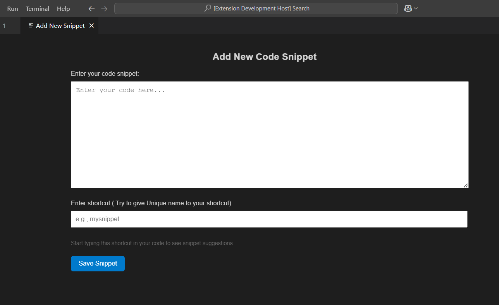

# SnippetVault

SnippetVault is a VS Code extension that allows you to create, save, and use custom code snippets across all your projects. With SnippetVault, you can streamline your development process by quickly inserting reusable code blocks via custom shortcuts.

---

## Features
- **Create Custom Snippets**: Save your frequently used code snippets with a custom shortcut.
- **Multiple Language Support**: Java, Python, C++, JavaScript, Jsx, Ruby, Rust, PHP, Kotlin and many more.
- **Global Persistence**: Your snippets are available across all projects, even after restarting VS Code.
- **Easy Access**: Start typing the shortcut, and your snippet will appear as a suggestion.
- **Rich Documentation**: View snippet details and documentation while coding.

---

## How to Use SnippetVault

### Adding a Snippet
1. Press `Ctrl+Shift+P` (or `Cmd+Shift+P` on Mac) to open the Command Palette.
2. Search for and select **SnippetVault: add snippet**.
         or
3. **Windows** `Ctrl+Shift+N` 
-
     **mac**   `Cmd+Shift+N`  
   
4. A webview will open:
   - Enter your code snippet in the provided text area.
   - Enter a unique shortcut for the snippet.
   - Click the "Save Snippet" button.
5. You will see a confirmation message in the bottom indicating that your snippet was saved.

### Using Snippets
1. Open any file in VS Code.
2. Start typing the shortcut you assigned to your snippet.
3. The snippet will appear in the IntelliSense suggestions.
4. Press `Enter` or `Tab` to insert the snippet into your code.

### Editing or Deleting Snippets
Currently, editing or deleting snippets is not supported directly from the extension. However, you can manually edit or remove snippets from the global storage file if needed.

---

## Development

### Prerequisites
- Node.js
- Visual Studio Code

---

## Future Enhancements
- **Snippet Management**: Add options to edit and delete saved snippets.
- **Export/Import Snippets**: Allow users to export and import snippets to/from JSON files.
- **Cloud Sync**: Enable syncing snippets across devices.

---

## License
This project is licensed under the MIT License. See the  [MIT License](LICENSE.md) file for details.

---

## Support
For any issues or feature requests, please create an issue in the GitHub repository or contact the project maintainer.

If Liked please give Rating &#11088;
